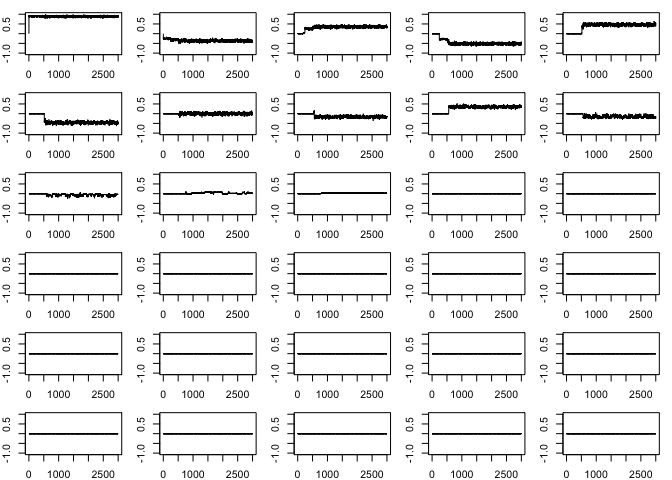

<!-- README.md is generated from README.Rmd. Please edit that file -->

# rjmc

<!-- badges: start -->
<!-- badges: end -->

The goal of rjmc is to …

## Installation

You can install the development version of rjmc from
[GitHub](https://github.com/) with:

``` r
# install.packages("devtools")
devtools::install_github("llrebecca21/rjmc")
```

## Example

We will walk through how to use this package to implement Example 1.2
from Robert and Casella’s “Efficient Construction of reversible jump
Markov chain Monte Carlo proposal distributions” (2003) and Example 2.7
in Godsill’s “On the Relationship Between Markov Chain Monte Carlo
Methods for Model Uncertainty” (2001).

First need to create a time series of length `maxT` with a known set of
true AR coefficients. We will use the coefficients given in the Godsill,
2001 paper.

``` r
# Create a time series using arima.sim
# length of time series
maxT = 1000
# AR coefficients
ar_c = c(0.9402,
         -0.43,
         0.4167,
         -0.4969,
         0.4771,
         -0.5010,
         0.0509,
         -0.2357,
         0.4024,
         -0.1549)
x = arima.sim(model = list("ar" = ar_c), n = maxT)
```

Now we can call the library and run an example using the
`rjmcmc_nested()` function.

``` r
library(rjmc)
set.seed(100)
iter = 10000
ex_1 = rjmcmc_nested(iter = iter,k = 3,sig2 = 1,x = x,kmax = 30)

plot(ex_1[-c(1:100),32])
```


``` r
# posterior probabilty
table(ex_1[-c(1:100),32])/(iter - 100)
#> 
#>            2            3            4            5            6            7 
#> 0.0140404040 0.0004040404 0.0274747475 0.0002020202 0.0005050505 0.0021212121 
#>            8            9           10           11           12           13 
#> 0.0015151515 0.0002020202 0.5160606061 0.3832323232 0.0528282828 0.0014141414

# anything after ar 10 were given 0, but allowed to go to 30
#plot(rj_mat[,11], type = "l")
#plot(rj_mat[,24], type = "l")

par(mfrow = c(6,5), mar = c(2,2,1,1))
for(d in 1:30){
  plot(ex_1[1:3000,d], type = "l", ylim = c(-1,1))
}
```



You’ll still need to render `README.Rmd` regularly, to keep `README.md`
up-to-date. `devtools::build_readme()` is handy for this.

You can also embed plots, for example:


In that case, don’t forget to commit and push the resulting figure
files, so they display on GitHub and CRAN.
