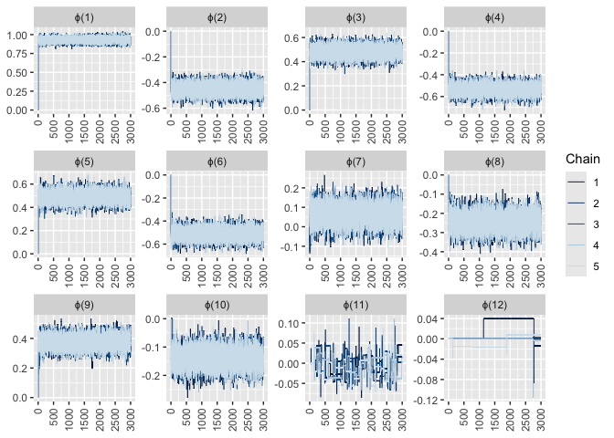
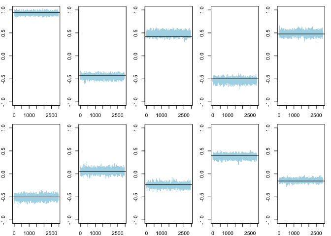

<!-- README.md is generated from README.Rmd. Please edit that file -->

# rjmc

<!-- badges: start -->
<!-- badges: end -->

The goal of rjmc is

## Installation

You can install the development version of rjmc from
[GitHub](https://github.com/) with:

``` r
# install.packages("devtools")
devtools::install_github("llrebecca21/rjmc")
```

## Example

We will walk through how to use this package to implement Example 1.2
from Robert and Casella’s “Efficient Construction of reversible jump
Markov chain Monte Carlo proposal distributions” (2003) and Example 2.7
in Godsill’s “On the Relationship Between Markov Chain Monte Carlo
Methods for Model Uncertainty” (2001).

First need to create a time series of length `maxT` with a known set of
true AR coefficients. We will use the coefficients given in the Godsill,
2001 paper.

``` r
# set the seed for reproducibility
set.seed(100)
# Create a time series using arima.sim
# length of time series
maxT = 1000
# AR coefficients
ar_c = c(0.9402,
         -0.43,
         0.4167,
         -0.4969,
         0.4771,
         -0.5010,
         0.0509,
         -0.2357,
         0.4024,
         -0.1549)
x = arima.sim(model = list("ar" = ar_c), n = maxT)
```

True `k` is then equal to `10`. In the vignette, we will show a few
examples with different starting values of `k` to see how well this
rjmcmc sampler can perform.

Now we can call the library and run an example using the
`rjmcmc_nested()` function.

``` r
library(rjmc)
#> Registered S3 method overwritten by 'GGally':
#>   method from   
#>   +.gg   ggplot2
library(bayesplot)
#> This is bayesplot version 1.10.0
#> - Online documentation and vignettes at mc-stan.org/bayesplot
#> - bayesplot theme set to bayesplot::theme_default()
#>    * Does _not_ affect other ggplot2 plots
#>    * See ?bayesplot_theme_set for details on theme setting
library(ggplot2)
# Set the number of iterations
iter = 3000
# Set the highest value k can possible take
kmax = 20
# Set starting value of k
k = 10
# Run the rjmcmc nested example on the time series
# Choose starting k = 10
# Create a list of data frames to store our chains
chains = 5
ex_1 = vector(mode = "list", length = chains)
for(i in 1:chains){
  ex_1[[i]]=rjmcmc_nested(iter = iter,k = k,sig2 = 1,x = x,kmax = kmax)
}

# extract the labels names
lab = colnames(ex_1[[1]])
```

``` r
# Plot the trace plots of all the AR(k) parameters
bayesplot::mcmc_trace(x = ex_1, pars = lab[-c(21:22)]) + theme(axis.text.x = element_text(angle = 90, vjust = 0.5, hjust=1))
```


Due to the many trace plots, it is difficult to determine where our
burn-in should be. So, let us plot the trace plots again but restricting
to only the AR(1) through AR(10) parameters.

``` r
bayesplot::mcmc_trace(x = ex_1, pars = lab[1:12]) + theme(axis.text.x = element_text(angle = 90, vjust = 0.5, hjust=1))
```



Seems the burn-in for this particular example should be around 200. Now
we will plot the trace plots again with the burn-in and standardize the
y-axis limits across all AR(k) plots.

# Plots with burn-in removed

``` r
burnin = 50

# Trace plots of sig2 and k
bayesplot::mcmc_trace(x = ex_1, pars = lab[21:22]) + xlim(burnin+1,3000)
```


``` r

# Plot the trace plots of all the AR(k) parameters
bayesplot::mcmc_trace(x = ex_1, pars = lab[-c(21,22)]) + xlim(burnin+1,iter) +
  ylim(-1,1)+
  theme(axis.text.x = element_text(angle = 90, vjust = 0.5, hjust=1))
```


``` r
# Table of the posterior probability
# table(ex_1[-c(1:burnin),22])/(iter - burnin)
# Trace plots of only AR(1) through AR(10)
bayesplot::mcmc_trace(x = ex_1, pars = lab[1:12]) + xlim(burnin+1,iter)+
  ylim(-1,1)+
  theme(axis.text.x = element_text(angle = 90, vjust = 0.5, hjust=1))
```


Looking at just the AR(1) through AR(10) trace plots (in base plot) we
can overlay them with a horizontal line of the true AR coefficients.

# Plots with burn-in removed

``` r
par(mfrow = c(2,5), mar = c(2,2,1,1))
for(d in 1:10){
  plot(ex_1[[1]][burnin:iter,d], type = "l", ylim = c(-1,1), col = "lightblue")
  #plot true ar coefficient value
  abline(h=ar_c[d], col = "black")
  #plot colmeans ar coefficient value
  #abline(h=mean(ex_1[burnin:iter,d]), col = "blue")
}
```



``` r
# Look at the values of the red and blue lines and store into a small matrix:
# true vs.colmeans
# create padded version of ar_c
true_ar = append(ar_c, rep(0,kmax-length(ar_c)))
comp_ar = matrix(NA, nrow = kmax, ncol = 4)
# fill first column with true_ar values
comp_ar[,1] = true_ar
for(i in 1:20){
  comp_ar[i,2] = mean(ex_1[[1]][burnin:iter,i])
  comp_ar[i,3] = sd(ex_1[[1]][burnin:iter,i])
  # The third column of the matrix contains the absolute value difference between the first two columns
  comp_ar[i,4] = (comp_ar[i,2] - comp_ar[i,1])/comp_ar[i,3]
}
comp_ar
#>          [,1]         [,2]       [,3]       [,4]
#>  [1,]  0.9402  0.929880627 0.03144157 -0.3282079
#>  [2,] -0.4300 -0.450901740 0.04201777 -0.4974500
#>  [3,]  0.4167  0.482997195 0.04346885  1.5251658
#>  [4,] -0.4969 -0.535536203 0.04596445 -0.8405671
#>  [5,]  0.4771  0.489233954 0.04667107  0.2599888
#>  [6,] -0.5010 -0.511065822 0.04749094 -0.2119525
#>  [7,]  0.0509  0.061655176 0.04716399  0.2280379
#>  [8,] -0.2357 -0.245219753 0.04376627 -0.2175135
#>  [9,]  0.4024  0.375755380 0.04248514 -0.6271516
#> [10,] -0.1549 -0.140214796 0.03270736  0.4489878
#> [11,]  0.0000 -0.009881755 0.02397680 -0.4121381
#> [12,]  0.0000  0.020806286 0.02128831  0.9773571
#> [13,]  0.0000  0.000000000 0.00000000        NaN
#> [14,]  0.0000  0.000000000 0.00000000        NaN
#> [15,]  0.0000  0.000000000 0.00000000        NaN
#> [16,]  0.0000  0.000000000 0.00000000        NaN
#> [17,]  0.0000  0.000000000 0.00000000        NaN
#> [18,]  0.0000  0.000000000 0.00000000        NaN
#> [19,]  0.0000  0.000000000 0.00000000        NaN
#> [20,]  0.0000  0.000000000 0.00000000        NaN
plot(comp_ar[,4], ylab = "Standardized Residual",
     xlab = "k",
     xaxt = "n",
     las = 1,
     main = "Standardized Bayes Estimator Residual of\n the AR Coefficients")
abline(h = 0, col = "red")
axis(1, at = 1:20)
```


