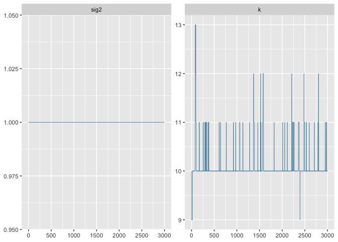
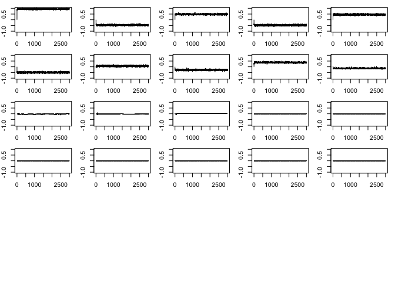
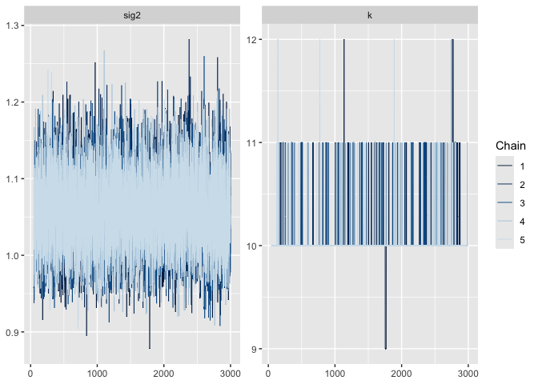
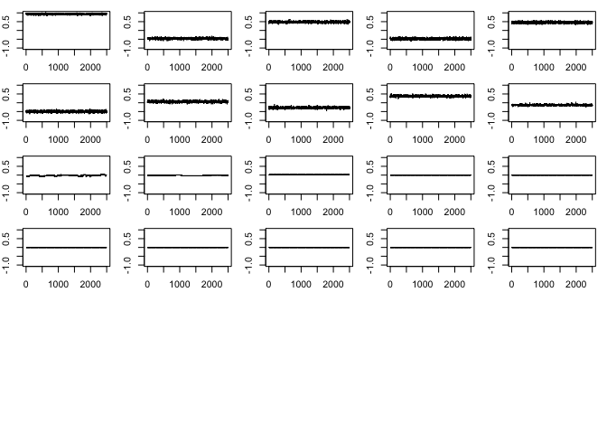

<!-- README.md is generated from README.Rmd. Please edit that file -->

# rjmc

<!-- badges: start -->
<!-- badges: end -->

The goal of rjmc is to …

## Installation

You can install the development version of rjmc from
[GitHub](https://github.com/) with:

``` r
# install.packages("devtools")
devtools::install_github("llrebecca21/rjmc")
```

## Example

We will walk through how to use this package to implement Example 1.2
from Robert and Casella’s “Efficient Construction of reversible jump
Markov chain Monte Carlo proposal distributions” (2003) and Example 2.7
in Godsill’s “On the Relationship Between Markov Chain Monte Carlo
Methods for Model Uncertainty” (2001).

First need to create a time series of length `maxT` with a known set of
true AR coefficients. We will use the coefficients given in the Godsill,
2001 paper.

``` r
# Create a time series using arima.sim
# length of time series
maxT = 1000
# AR coefficients
ar_c = c(0.9402,
         -0.43,
         0.4167,
         -0.4969,
         0.4771,
         -0.5010,
         0.0509,
         -0.2357,
         0.4024,
         -0.1549)
x = arima.sim(model = list("ar" = ar_c), n = maxT)
```

Now we can call the library and run an example using the
`rjmcmc_nested()` function.

``` r
library(rjmc)
# set the seed for reproducibility
set.seed(100)
# Set the number of iterations
iter = 3000
# Run the rjmcmc nested example on the time series
ex_1 = rjmcmc_nested(iter = iter,k = 3,sig2 = 1,x = x,kmax = 30)
```

# Plots without burn-in

``` r
# Example plot output with burn-in of 500
plot(ex_1[1:iter,32])
```



``` r
# Table of the posterior probability
table(ex_1[1:iter,32])/(iter)
#> 
#>            2            3            4            5            6            7 
#> 0.0576666667 0.0020000000 0.0026666667 0.0016666667 0.0023333333 0.0083333333 
#>            8            9           10           11           12           13 
#> 0.0076666667 0.6946666667 0.1870000000 0.0256666667 0.0053333333 0.0043333333 
#>           14 
#> 0.0006666667
```

View the plots first without burn-in to determine what burn-in should
be:

``` r
par(mfrow = c(6,5), mar = c(2,2,1,1))
for(d in 1:30){
  plot(ex_1[1:iter,d], type = "l", ylim = c(-1,1))
}
```



Seems the burn-in for this particular example should be around 500.

# Plots with burn-in removed

``` r
burnin = 500
# Example plot output with burn-in of 500
plot(ex_1[-c(1:burnin),32])
```



``` r
# Table of the posterior probability
table(ex_1[-c(1:burnin),32])/(iter - burnin)
#> 
#>      9     10     11     12     13     14 
#> 0.7592 0.1984 0.0300 0.0064 0.0052 0.0008
```

``` r
par(mfrow = c(6,5), mar = c(2,2,1,1))
for(d in 1:30){
  plot(ex_1[burnin:iter,d], type = "l", ylim = c(-1,1))
}
```


